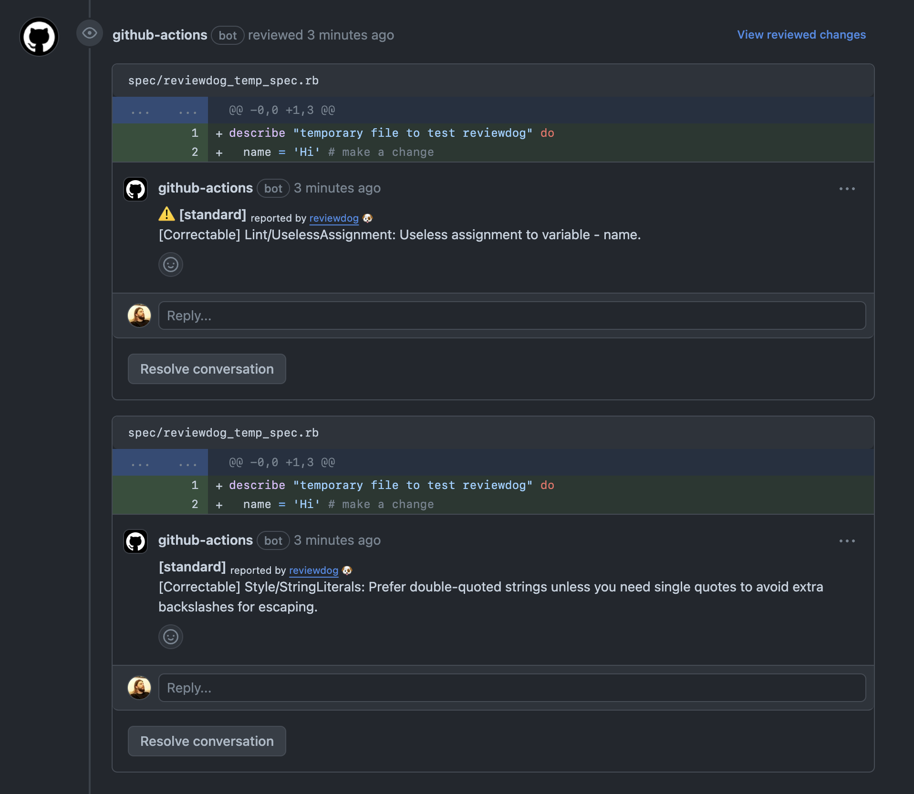

# GitHub Action: Run Standard Ruby and Standard Rails with reviewdog 🐶

This action runs [standardrb](https://github.com/testdouble/standard) with
[reviewdog](https://github.com/reviewdog/reviewdog) on pull requests to improve
code review experience.

## Example usage

```yml
name: Lint

on: pull_request

jobs:
  standardrb:
    name: Standard Ruby
    runs-on: ubuntu-latest
    steps:
      - name: Check out code
        uses: actions/checkout@v3
      - name: standardrb
        uses: smile-io/action-standardrb@master
        with:
          github_token: ${{ secrets.github_token }}
          standard_version: 1.36.0
          standard_rails_version: 1.0.2
```

## Examples


## License

[MIT](https://choosealicense.com/licenses/mit)
